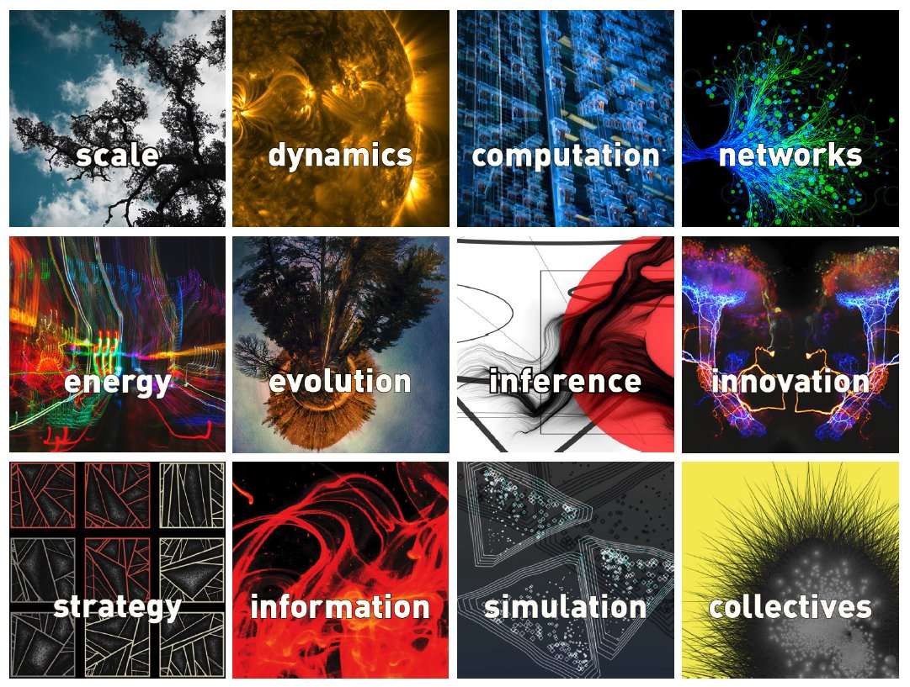
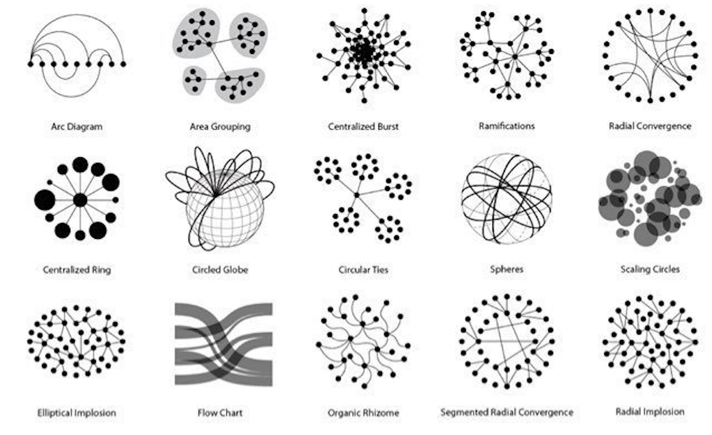

# Complexity-Resources
From Basic to Advanced. Complex does not equal complicated, a computer for example is complicated, whereas the brain is complex. Complexity is a property of the systems as a whole. The science of complexity takes a global view of the world, it regards the interrelations between systems and the elements that they are made up of. This hollistic apporach is deterministic but nonreductionistic.

* [1. Basics in Complexity](#basics-in-comlexity)
* [2. Advanced Complex Systems](#advanced-complex-systems)
* [3. Complexity Research](#complexity-research)
* [Complexity Paper](#complexity-paper)
* [Other Resources](#other-resources)

  

## Basics in Complexity:
Butterfly effect: even initial situations that are very close to one another may present a difference that becomes sizeable over time, this property is called sensitivity to initial conditions. Improving the precision of measurement can to some extend increase the so-called predictability horizon, but errors introduced by using approximations increasingly amplify themself. Unstable dynamical systems are characterized by the unpredictability this effect causes. This is called deterministic chaos, it is the substantial and intrinsic unpredictability of the future evolution of both a real system and an abstract model. 

* [Book: James Gleick - Chaos: Making a New Science](https://www.amazon.com/Chaos-Making-Science-James-Gleick/dp/0143113453/ref=sr_1_1?ie=UTF8&qid=1540898509&sr=8-1&keywords=chaos+james+gleick): history of chaos in science; butterfly effect, scientific revolution, modeling wildlife popultion, nonlinear science, bifurcations, fractal geometry, phase space, Feigenbaum, Mandelbrot set, information theory, micro to macroscale, dynamical heart
* [Book: John Gribbin - Deep Simplicity: Bringing Order to Chaos and Complexity](https://www.amazon.com/Deep-Simplicity-Bringing-Order-Complexity/dp/140006256X):
* [Book: Steven Johnson - Emergence](https://www.amazon.de/Emergence-Connected-Brains-Cities-Software/dp/0684868768/ref=sr_1_2?ie=UTF8&qid=1544757158&sr=8-2&keywords=Steven+Johnson+-+Emergence):
* [Book: Steven Strogatz - SYNC: The Emerging Scinence of Spontaneous Order](https://www.amazon.de/Sync-Emerging-Science-Spontaneous-Order/dp/0786868449/ref=sr_1_fkmr0_1?ie=UTF8&qid=1544757185&sr=8-1-fkmr0&keywords=SYNC%3A+The+Emerging+Scinence+of+3Spontaneous+Order):
* [Book: Gary Marcus - The Birth of the Mind: How Genes create the Complexity of Human Thought](https://www.amazon.de/Birth-Mind-Creates-Complexities-Thought-ebook/dp/B06XCDZ3GP/ref=sr_1_1?ie=UTF8&qid=1544757223&sr=8-1&keywords=The+Birth+of+the+Mind%3A+How+Genes+create+the+Complexity+of+Human+Thought):
* [Website: Reddit - Complex Systems](https://www.reddit.com/r/complexsystems/)
* [Website: Reddit - Data is beautiful](https://www.reddit.com/r/dataisbeautiful/)
* [Website: Information is beautiful](https://informationisbeautiful.net)
* [Video: Kurzgesagt(In a nutshell) - Emergence: How Stupid Things Become Smart Together](https://www.youtube.com/watch?v=16W7c0mb-rE&t=7s)
* [Video: Stanford/Robert Sapolsky - Chaos and Reductionism](https://www.youtube.com/watch?v=_njf8jwEGRo)
* [Video: Stanford/Robert Sapolsky - Emergence and Complexity](https://www.youtube.com/watch?v=o_ZuWbX-CyE&t=537s)
* [Movie: The most unknown](https://www.themostunknown.com)

## Advanced Complex Systems
- Merge advanced / research; different sections and subsections 
* [Website: Complexity Labs](http://complexitylabs.io): an online platform for the research, education, analysis and design of complex systems. Posts, Magazins, Videos, Books and Paper are available.
* [Videos: Complexity Labs](http://complexitylabs.io/videos-home/): critical thinking, systems thinking, network theory, systems theory, adaptive systems, emergence, game theory, complexity theory, nonlinear systems, social complexity, systems ecology, complexity economics, financial complexity
* [Book: Cristoforo Sergio Bertuglia - Nonlinearity, Chaos, and Complexity: The Dynamics of Natural and Social Systems](https://www.amazon.com/Nonlinearity-Chaos-Complexity-Dynamics-Natural/dp/0198567901): Modelling, Mechanics, Linearity as first approximation, pendulum as natural nonlinear process, phase space, mathematical economics, economic cycle, chaotic pendulum, social processes: two interacting populations + nonlinearity (Volterra-Lotka model), chaos, strange and chaotic attractors, stability in dynamic systems, measuring chaos in real systems, logistic growth, logisitc map, complexity, inadequacy of reductionism, determinism, self-organization, complexity and evolution
* [Book: Melanie Mitchelln - Complexity: A guided tour](): background and history, information, computation, evolution, genetics, life and evolution in computers, cellular automata, information processing in living systems, network thinking, mystery of scaling, evolution, complexified

https://www.reddit.com/r/compsci/comments/91ocq7/recommendation_for_complexity_theory_courseware/

-add self-organization and emergence 
-add scaling (especially in biological systems)
- Network science (science of networks applied to real-world networks) / examples brains etc. 
- Evolution of complex (adaptive) systems 

### Fractals/ Scale
- Definition: fractal video (Definition dimension)
- Elliot waves
* https://github.com/Tenchi2xh/Almonds
* [Video: 3Blue1Brown - Fractals are typically not self-similar](https://www.youtube.com/watch?v=gB9n2gHsHN4)
- fractal dimensions (https://en.wikipedia.org/wiki/Fractal_dimension)
- Feigenbaum tree of bifurcations (real scale invariance (technically known as self-similarity) can be identified)

## Complexity Research
Related research fields/buzzwords: modeling artificial life, choas theory, genetic algorithms, complexity economics, econophysics, complex networks, systems biology, self-organization, emergence, complex adaptive systems, cybernetics, cognitive modeling, fractal geometry, multi-agent systems, nonlinearity
* [Course: Coursera - Advanced Algorithms and Complexity](https://www.coursera.org/learn/advanced-algorithms-and-complexity): flows in networks, linear programming, NP-complete problems, streaming algorithms
* [Courses: Coursera - Specialisation Systems Biology](https://www.coursera.org/specializations/systems-biology): Approx. 7 months to complete - Introduction to systems biology, experimental methods, network analysis, dynamical modeling, integrated analysis, biotechnology capstone
* [Courses: Universities in Netherlands - Complexity Science Courses](http://ias.uva.nl/binaries/content/assets/subsites/uva-institute-for-advanced-studies/course-list-ias-final.pdf?2977919327694.): simplifing complexity, self-organization, complex network, complex systems, complexity and networks, complex system simulation, agent-based modeling, systems biology, complexity and behavior
* [Videos: 2018 Santa Fe Institute Complexity Labs](https://www.complexityexplorer.org/courses): wide range of courses and tutorials. Introduction to Complexity, Nonlinear Dynamics: Mathematical and Computational Approaches, Introduction to Dynamical Systems and Chaos, Fractals and Scaling, Algorithmic Information Dynamics.

- MIT books

Introduction to the Theory of Complex Systems (https://global.oup.com/academic/product/introduction-to-the-theory-of-complex-systems-9780198821939?cc=au&lang=en&)

* [Lecture: Series on Chaos, Fractals and Dynamical Systems by Prof. S. Banerjee (IIT Kharagpur)](https://www.youtube.com/watch?v=mkfU9zVNGkQ&list=PLF07D9DF54FE3D3EF1)

https://www.quantamagazine.org/the-beautiful-intelligence-of-bacteria-and-other-microbes-20171113/

### Information theory:
* [Book: Thomas M. Cover - Elements of Information Theory](https://www.amazon.com/Elements-Information-Theory-Telecommunications-Processing/dp/0471241954)
* [Book: Ming Li  - An Introduction to Kolmogorov Complexity and Its Applications](https://www.amazon.com/Introduction-Kolmogorov-Complexity-Applications-Computer/dp/0387339981)
(structure from wikipedia / add additional information)

- randomness
- Information density 
- dimensionality reduction
- laws of theormodynamics 

https://www.reddit.com/r/compsci/comments/1prnxi/complexity_theoryinformation_theory_reading/

### Computation
What does computing mean?
- Neural computation
- collective computation (swarm intelligence)
- nature-inspired computation (e.g. immune system)
- evolutionary computing (https://www.mitpressjournals.org/loi/evco)

### Math:
Phase space, orbit, basin of attraction and attractor are all mathematical concepts and as such abstract models constructed from observed processes. 

- graph theory (math)
- network theory 

The Lyapunov exponents provides a measurment of the stability of a dynamical system, they quantify the level of chaos by indicating the speed of growth (instability) or reduction (stability). The sum of these exponents known as the Kolmogorov–Sinai entropy it is an indicator of the extent to which the system is unpredictable (the higher, the less predictable).

## Complexity Paper
- Poincare
- Mandelbrot 
-Chao Tang and Kurt Wiesenfeld; sandpile model
- Stuart Kauff man’s ‘button’ model 
- Historic paper/ review 

-global pattern donation and ethic/cultural violence (New England complex systems institute) 
-morphogenesis”—the capacity of all life-forms to develop ever more baroque bodies out of impossibly simple beginnings - Turing
* [Paper: SM. E. J. Newman - Complex Systems: A Survey](https://arxiv.org/abs/1112.1440)
* [Paper: Nature - Complexity Research in Nature Communications](https://www.nature.com/collections/ycjylwzvmz)

Complexity in neuroscience: https://www.nature.com/collections/ycjylwzvmz/neuroscience

### Applied complexity research
Economies are self-organizing systems they are dealing with dynamic, changing systems, in which positive feedbacks are involved (stock market). Social systems in general are instable and very often 'situations' are different from each other, which makes the determination of regularities difficult.

* Thermodynamics
-Neural networks
- Biological poulations (movment of human populations/ Bak-Sneppen model): story of life in the Universe is an example of surface complexity built upon foundations of simple rules.
- ants eusocial insects (aided by group selection - single super organism) 
- Evolution (individual selection, kin selection, reciprocal altruism) 
- Genetic analysis (interactions during evolution/ evolution as complexification of organisms/ tree of life)
-pubMed for complex gene analysis 
- Geoscinece/ Meterology (Earthquakes / Idea of Gaia, the Earth as a self-regulating system / Daisyworld model)
(https://serc.carleton.edu/NAGTWorkshops/complexsystems/activities/daisyworld.html)

- add pictures into text / include pictures on fitting on points (+ sources of pictures) 

  

- change picture to betwork theory and add background about this theory 

## Software
* [Software: Chaos - Book from James Gleick](https://github.com/rudyrucker/chaos)
* [Software: Think Complexity](https://github.com/AllenDowney/ThinkComplexity2)

### Cellular automata:
* https://github.com/natj/CellularAutomata.jl
* https://github.com/thearn/game-of-life

### Modeling:

### Artificial life:
* [Video: Stated Clearly - What Is the RNA World Hypothesis?](https://www.youtube.com/watch?v=K1xnYFCZ9Yg:idea that chains of RNA may have been the first things to replicate and evolve
* [Video: Stated Clearly - What Caused Life's Major Evolutionary Transitions?](https://www.youtube.com/watch?v=VUfNEHl44hc):
(https://www.nature.com/articles/374227a0)

### Computational modeling
'What I cannot create, I do not understand.' - Richard Feynman

Mathematical modelling has become an increasingly relevant instrument, reality often turns out too complicated to be summarized within a limited set of rules. Especially the assumptions underlying linearization are unacceptable, the further a phenomen is from a condition of stable equilibrium. Nonlinear models are often better suited, but they are limited due to incomplete knowledge of the initial state leading to approximations that worsen over time.

A model, intrinsically, is a partial representation of several aspects of reality, it remains only a tool of analysis, even though a fundamental one. To build such models it is important to identify the number of state variable need to constitute the phase space to contain the possible attractor (an the dimension of such). The number of state variables is often numerous and usually even impossible to identify.

All sciences have the identification and prediction of the evolution of systems over time in common, for this purpose modeling is well suited.

* neuroscience
- econometrics/ econophysics
- population modeling/ ecosystems
- weather forecast
- protein folding
- 

  

## Other Resources 

#### Persons to follow:

#### Institutes to follow:
https://www.santafe.edu
* [Complexity Science Hub Vienna](https://www.csh.ac.at)
* [Stanford Complexity Group](complexity.stanford.edu/)
* [Max Planck Institute for Dynamics and Self-Organization](https://www.ds.mpg.de/en)
* [Complex Systems Society](https://cssociety.org/home)
* [Netherlands Platform Complex Systems (NPCS)](https://www.npcs.nl)
* [Fractals Foundation](https://fractalfoundation.org/resources/what-is-chaos-theory/)

Monash University, Victoria

New England Complex System Institute (NECSI)

#### Blogs and Websites to follow:

-opendatascience

* [Website: Brilliant - free problems and examples in math, science, and engineering](https://brilliant.org)
* [Website: Khan Academy - varioius online lectures and courses](https://www.khanacademy.org/)
* [Website: Map of Science](https://journals.plos.org/plosone/article/figure?id=10.1371/journal.pone.0004803.g005)
* [Website: Quanta Magazine](https://www.quantamagazine.org)
* [Videos: Kurzgesagt_In a Nutshell - Make science look beautiful](https://www.youtube.com/channel/UCsXVk37bltHxD1rDPwtNM8Q)
* [Videps: Domain of Science](https://www.youtube.com/channel/UCxqAWLTk1CmBvZFPzeZMd9A): map of science, map of physics, map of computer science, map of chemistry, map of biology
* [Book: Yuval Harari - Sapiens](https://www.amazon.de/Sapiens-Humankind-Yuval-Noah-Harari/dp/1846558239)
* [Book: Yuval Harari - Homo Deus](https://www.amazon.de/Homo-Deus-Brief-History-Tomorrow/dp/1784703931/ref=pd_lpo_sbs_14_img_1?_encoding=UTF8&psc=1&refRID=V3KV2XCNBYTSC8JFJ5N1)
* [Podcast: Human Current - exity science & systems thinking in the workplace and beyond](http://www.human-current.com/#intro)
* [Podcast: Datasceptic - Data science, statistics, machine learning, artificial intelligence, and scientific skepticism.](https://dataskeptic.com)

http://understandingthecomplex.blogspot.com
http://www.if.pw.edu.pl/~agatka/catalogue/soc.html

http://chaosbook.org
